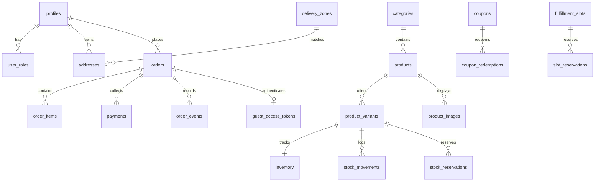

# Modelo de Dados Relacional - Doces da Angel

O modelo relacional do projeto Doces da Angel foi desenhado para garantir integridade referencial, bloqueio otimista contra concorrência e conformidade com privacidade.

## Tabelas e Estruturas Principais

1. **`profiles`** - Informações básicas do cliente sincronizadas com `auth.users`.
2. **`user_roles`** - Papéis protegidos (`customer`, `operator`, `admin`).
3. **`addresses`** - Endereços cadastrados pelos clientes autenticados.
4. **`categories`** - Categorias do catálogo (`Bolo de Pote`, `Cocadas`, `Doces de Leite`, etc.).
5. **`products`** - Entidade principal do produto (nome, slug, descrição, ingredientes, alergênicos, status).
6. **`product_variants`** - Unidades vendáveis com SKU, preço em centavos, estoque mínimo/máximo e tempo de preparo.
7. **`product_images`** - Caminho no Supabase Storage e textos alternativos de acessibilidade.
8. **`inventory`** - Saldo de estoque (`on_hand`, `reserved`). Restrição `on_hand >= reserved`.
9. **`stock_movements`** - Livro-razão imutável de entradas e saídas de estoque.
10. **`stock_reservations`** - Reservas temporárias vinculadas a pedidos pendentes de pagamento.
11. **`delivery_zones`** - Zonas de entrega local por faixas de CEP com taxa e pedido mínimo.
12. **`fulfillment_slots`** - Janelas de horário para retirada ou entrega com capacidade máxima.
13. **`slot_reservations`** - Vagas temporárias reservadas durante o checkout.
14. **`coupons`** - Regras de desconto percentual ou fixo, vigência e limites de uso.
15. **`coupon_redemptions`** - Registro de uso de cupons por pedido e cliente.
16. **`orders`** - Cabeçalho do pedido com snapshots imutáveis de endereço e contato, totais e status.
17. **`order_items`** - Linhas do pedido com snapshots de nome, SKU, variante e preço unitário no momento da compra.
18. **`payments`** - Histórico de tentativas de pagamento com provedor, ID externo e status.
19. **`refunds`** - Registros de reembolso com chave de idempotência e motivo auditado.
20. **`webhook_events`** - Deduplicação e registro de eventos recebidos dos gateways.
21. **`order_events`** - Linha do tempo auditável de mudanças de status do pedido.
22. **`checkout_requests`** - Tabela de idempotência de checkout por chave e hash da requisição.
23. **`guest_access_tokens`** - Tokens criptográficos seguros com hash SHA-256 para acompanhamento de visitantes.
24. **`outbox`** - Mensageria transacional e envio assíncrono e confiável de emails.
25. **`inquiries`** - Formulário de encomendas personalizadas com status operacional.
26. **`store_settings`** - Configurações públicas da confeitaria, horário de funcionamento e status da loja.
27. **`audit_logs`** - Trilha de auditoria para ações administrativas sensíveis.
28. **`stock_lots` & `stock_allocations`** - Estrutura preparada para rastreabilidade de lotes e validades de alimentos.
